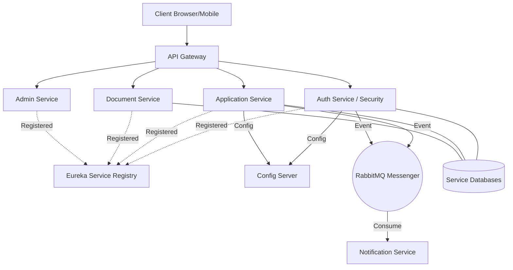

<<<<<<< HEAD
# finflow_loan-mangement-system
=======
# 🌊 FinFlow Loan Management System

[](https://spring.io/projects/spring-boot)
[](https://spring.io/projects/spring-cloud)
[](LICENSE)
[](http://localhost:9000)

**FinFlow** is a modern, microservices-based loan management platform designed for scalability, observability, and high-quality software engineering. It streamlines the entire loan lifecycle—from authentication and document submission to administrative approval and automated notifications.

---

## 🏛️ Architecture & Data Flow

FinFlow leverages a multi-service architecture centered around the **Spring Cloud Ecosystem**.



---

## 🛠️ Microservice Breakdown

- **🔐 Auth Service**: RBAC-based security using JWT. Handles user onboarding and identity management.
- **📁 Document Service**: Secure storage and mapping for loan-related documents.
- **📄 Application Service**: The core domain handler; manages draft creation, submission, and validation.
- **👔 Admin Service**: A specialized portal service for the centralized evaluation of loan requests.
- **🔔 Notification Service**: Asynchronous, event-driven service utilizing RabbitMQ for high-throughput messaging.
- **🛠️ Config & Discovery**: Infrastructure services ensuring high availability (`Eureka`) and centralized governance (`Config Server`).

---

## 🚀 Key Technical Highlights

### 1. **Distributed Observability**
FinFlow implements a complete observability stack:
- **Distributed Tracing**: Brave/Zipkin for request tracking across boundaries.
- **Log Aggregation**: Grafana Loki for centralized logging.
- **Metrics**: Micrometer + Prometheus for real-time health and performance data.

### 2. **Event-Driven Architecture**
Uses **RabbitMQ** to decouple heavy notification tasks (like email dispatch) from the core transaction flow, improving system responsiveness and reliability.

### 3. **Clean Code & Compliance**
The repository is strictly monitored for quality:
- **SonarQube**: Passed security, reliability, and maintainability gates.
- **Design Patterns**: Heavy use of Builder patterns, DTOs for layer isolation, and Factory/Strategy patterns where applicable.
- **Unit Testing**: Comprehensive test suites for controllers, services, and security layers.

---

## 🚦 System Initialization

### Prerequisites
- Java 17+
- Maven 3.8+
- Docker (Desktop recommended)
- MySQL & RabbitMQ (Available via included docker-compose)

### Quick Start
```bash
# Clone the repository
git clone https://github.com/your-username/finflow.git
cd finflow

# Multi-module Build
mvn clean install -DskipTests

# Start Infrastructure & Services
docker-compose up -d
```

---

## 📊 Monitoring Access

| Dashboard | Local URL |
| :--- | :--- |
| **Eureka Registry** | [http://localhost:8761](http://localhost:8761) |
| **Zipkin Tracing** | [http://localhost:9411](http://localhost:9411) |
| **API Documentation** | [http://localhost:8080/swagger-ui.html](http://localhost:8080/swagger-ui.html) |
| **Loki Logs** | [http://localhost:3100](http://localhost:3100) |

---

## 🔒 Security Policy

For security concerns, please refer to our [SECURITY.md](SECURITY.md).
Current implementation uses **HS256 JWT** signing for intra-service communication via the Gateway.

---

## 👨‍💻 Author
**Durga Prasad** - *Lead Architect & Full Stack Engineer*

---

Licensed under the [MIT License](LICENSE).
>>>>>>> 0188393 (🚀 initial: Complete FinFlow Microservices Architecture - Modular Config & Observability)
