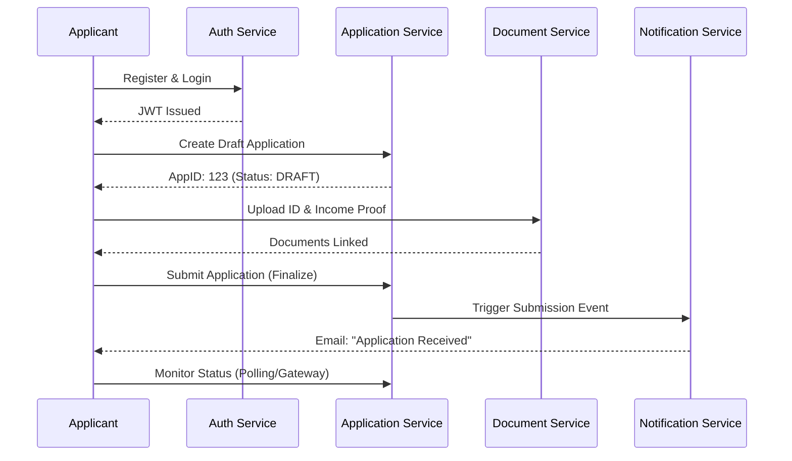
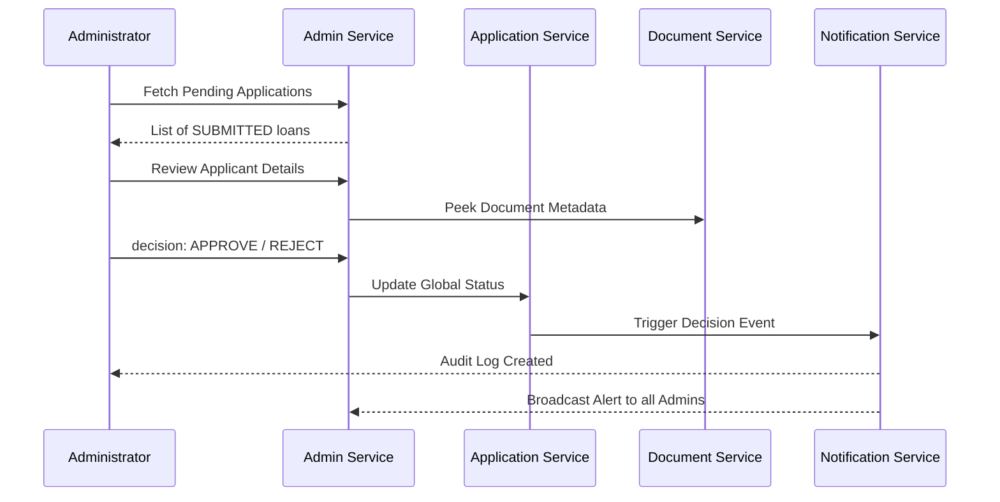

# 🔄 FinFlow Business Workflows

This guide outlines the standard end-to-end journey for both **Applicants** and **Administrators** within the FinFlow Loan Management System.

---

## 🙋‍♂️ Applicant Workflow

The applicant's journey focuses on a seamless, document-driven loan request process.

### Key Applicant Actions:
- **`POST /api/auth/register`**: Onboard into the system.
- **`POST /api/applications`**: Start a new loan (creates a `DRAFT`).
- **`POST /api/documents/upload`**: Securely upload required KYC/Financial files.
- **`PATCH /api/applications/{id}/status?status=SUBMITTED`**: Transition the loan to the review phase.
- **`GET /api/applications/me`**: Track progress in real-time.

---

## 👔 Administrator Workflow

The administrator act as the "Reviewer," managing the risk and approval lifecycle.

### Key Administrator Actions:
- **`GET /api/admin/applications/pending`**: View the queue of applications awaiting review.
- **`GET /api/admin/documents/{appId}`**: Audit the validity of uploaded files.
- **`POST /api/admin/decide`**: The final action to either move a loan to `APPROVED` or `REJECTED`. 
- **`GET /api/admin/audit`**: View a system-wide log of all administrative decisions for compliance across the microservice mesh.

---

## 🚦 Application Status Lifecycle

1.  **`DRAFT`**: Initial creation (Applicant).
2.  **`PENDING_DOCS`**: Awaiting file uploads (Auto-transitioned or manually flagged).
3.  **`SUBMITTED`**: Ready for administrative review (Applicant final action).
4.  **`UNDER_REVIEW`**: Currently being audited by an Admin (Admin starts work).
5.  **`APPROVED` / `REJECTED`**: The terminal business states (Admin final action).
6.  **`CLOSED`**: Lifecycle complete after disbursement or withdrawal.
